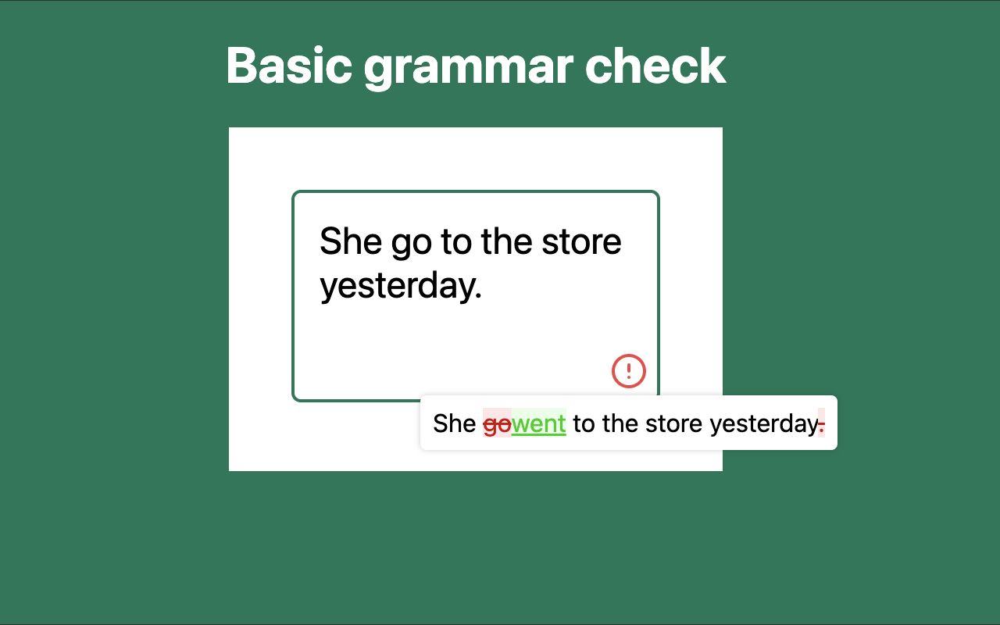
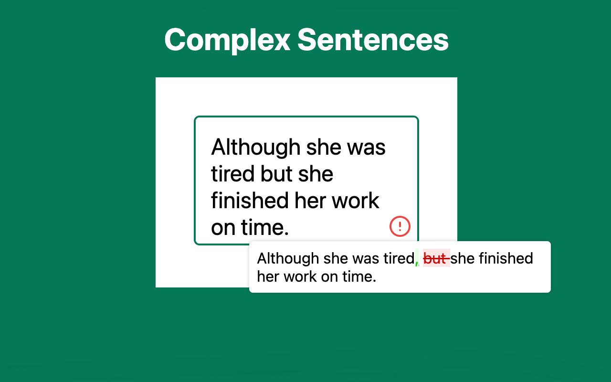

# ai-grammar

|  |  |
| :----------------------------------------------------------: | :------------------------------------------------------: |

> Completely free and open source Chrome AI Grammar Check Extension

- Completely free. No subscriptions required. No ads.
- Absolutely safe. AI works on your machine. No data sent to the internet.
- Smart grammar check. Checks full sentences, not only individual words.

[Download from Chrome Web Store](https://chromewebstore.google.com/detail/free-ai-grammar-checker/jnkjkpapplndagboidnhphaciphgjeca)

## Installing

For installation you have two options (you need to choose only one):

**First option: Using local installed Ollama server (preferred for now):**

1. Install [Ollama](https://ollama.com/download)
2. Install `ollama3.1` model:

Open terminal and run:

```shell
ollama run llama3.1
```

3. Set CORS headers:

For macOS open terminal and run:

```shell
launchctl setenv OLLAMA_ORIGINS "*"
```

For other OS please check [this](https://medium.com/dcoderai/how-to-handle-cors-settings-in-ollama-a-comprehensive-guide-ee2a5a1beef0)

4. Restart Ollama server:

for macOS: click on the Ollama icon in the menu bar and click "Quit Ollama" and then run Ollama from the Launchpad (or Applications folder) again.

---

**Second option: Using Built-in AI in future versions of Chrome:**

1. Install [Chrome canary version](https://www.google.com/chrome/canary/)
2. Open `chrome://flags/#prompt-api-for-gemini-nano` and set it to `Enabled`
3. Open `chrome://flags/#optimization-guide-on-device-model` and set it to `Enabled BypassPrefRequirement`
4. Go to `chrome://components` and click "Check for Update" on "Optimization Guide On Device Model"

If something goes wrong reload the page, if it doesn't work please [open an issue](https://github.com/nucleartux/ai-grammar/issues/new).

## Developing

run the command

```shell
$ cd ai-grammar

$ npm install
$ npm run build
```

### Chrome Extension Developer Mode

1. set your Chrome browser 'Developer mode' up
2. click 'Load unpacked', and select `ai-grammar/build` folder
